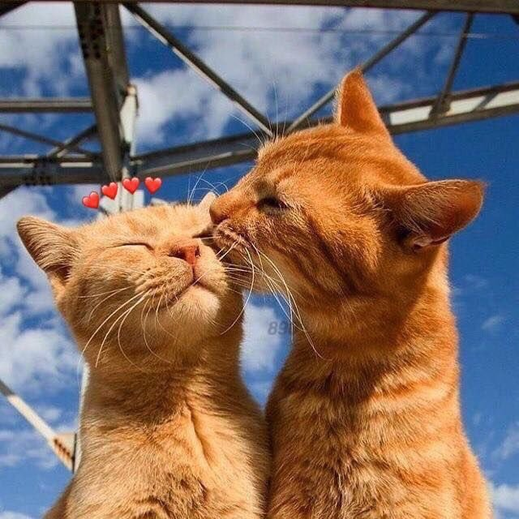

<!DOCTYPE html>
<html lang="pt-BR">
<head>
  <meta charset="UTF-8">
  <title>Pra Você 💖</title>
  
</head>
<body>
  

    
    <h1>Oi, você! 💕</h1>
    
Talvez você nem imagine, mas eu vejo algo muito especial em você.

    
Você é linda, gentil, divertida e tem uma vibe que me encanta demais.

    
Não tô aqui pra fazer rodeio: tô afim de você. De verdade mesmo 😳

    
Se esse sentimento for recíproco... já pensou onde isso pode dar?

    
❤️

  

</body>
</html>
